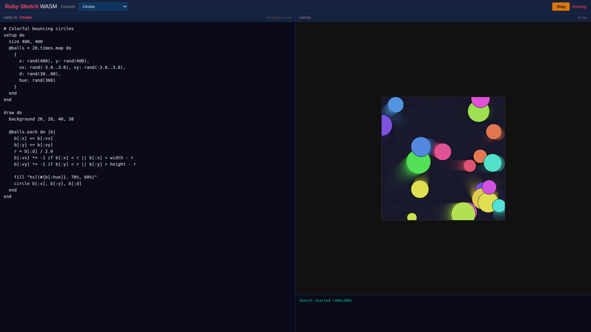
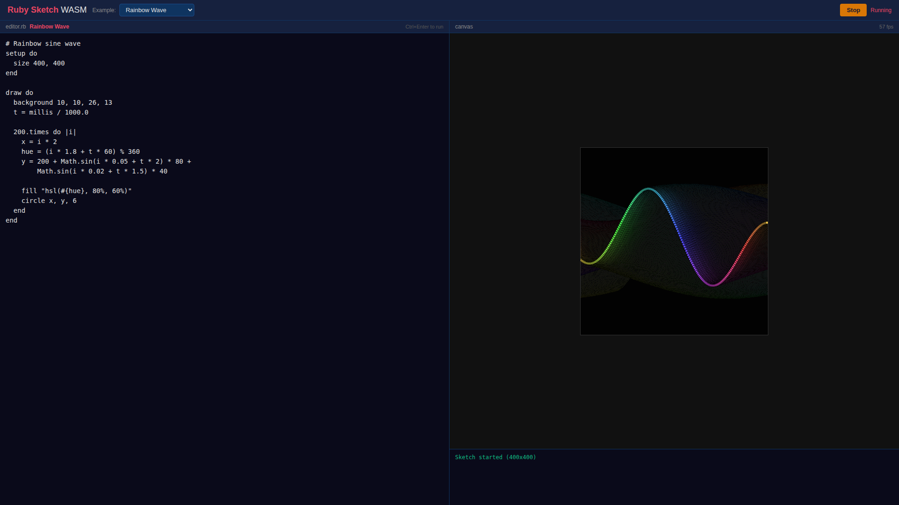
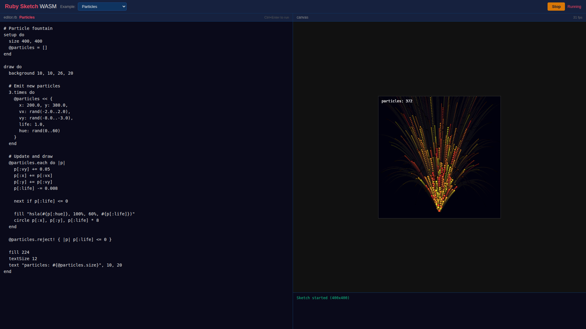
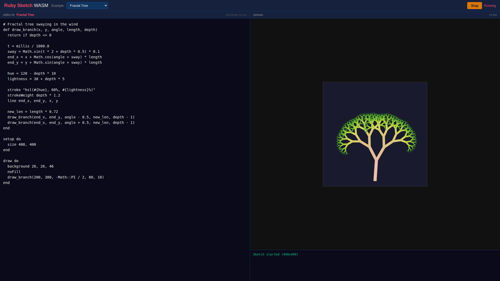
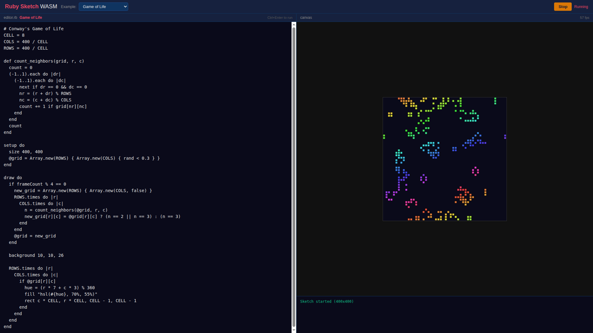
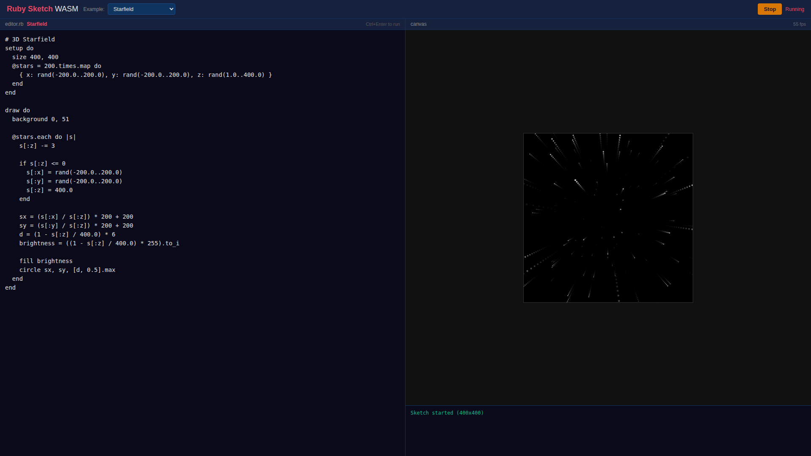
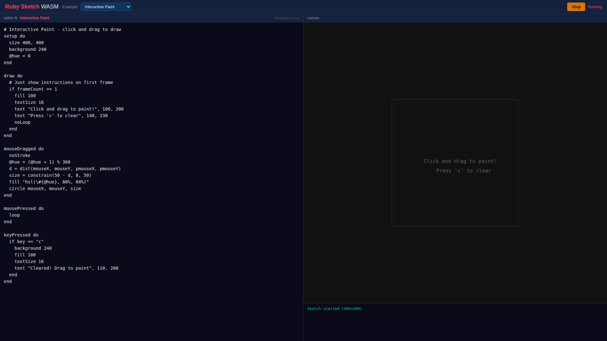
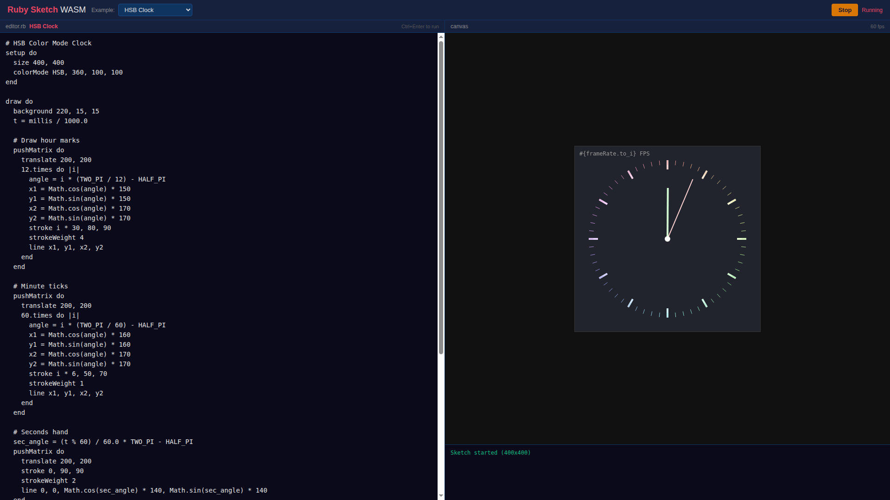
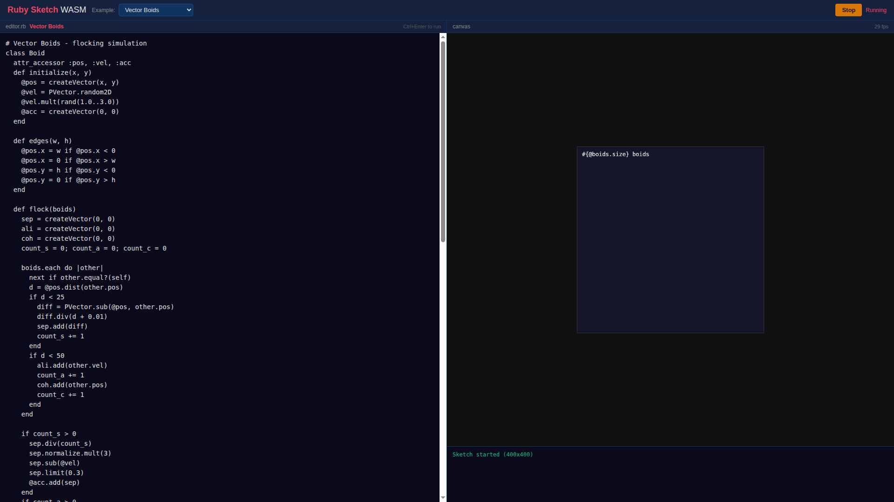

# Ruby Sketch WASM

ブラウザ上で Ruby を使った Processing スタイルのクリエイティブコーディングができる環境です。Ruby 3.3 を WebAssembly にコンパイルし、ビルド不要・インストール不要で動作します。

**Live Demo**: https://kazuph.github.io/vibe-coding-apps/ruby-sketch-wasm/

## 特徴

- Ruby 3.3 が WebAssembly でブラウザ内で直接動作
- Processing / RubySketch 互換の DSL（`setup`, `draw`, `fill`, `stroke`, `circle`, `rect` など）
- HTML5 Canvas によるリアルタイム描画
- マウス・キーボードイベント対応
- PVector クラスによるベクトル演算
- HSB / RGB カラーモード対応

## サンプル

9つのビルトインサンプルが用意されています。

### Circles

カラフルなボールが弾むアニメーション。



### Rainbow Wave

虹色のサイン波アニメーション。



### Particles

パーティクル噴水エフェクト。



### Fractal Tree

再帰的に描画されるフラクタルツリー。



### Game of Life

コンウェイのライフゲーム（セルオートマトン）。



### Starfield

中心から星が飛び出す 3D 風アニメーション。



### Interactive Paint

クリック&ドラッグで描画するインタラクティブペイント。



### HSB Clock

HSB カラーモードを使ったアナログ時計。



### Vector Boids

PVector を使った群れシミュレーション（Boids）。



## 使い方

1. [Live Demo](https://kazuph.github.io/vibe-coding-apps/ruby-sketch-wasm/) を開く
2. ドロップダウンからサンプルを選択するか、エディタに Ruby コードを書く
3. **Run** ボタン（または `Ctrl+Enter`）で実行

```ruby
# 例: 円がキャンバス内を跳ね回るスケッチ
setup do
  size 400, 400
end

draw do
  background 0
  fill 255, 100, 100
  circle mouseX, mouseY, 50
end
```

## テスト

Playwright による E2E テストが用意されています。

```bash
node test-server.cjs  # ローカルテストサーバー起動
npx playwright test docs/ruby-sketch-wasm/test.cjs
```

## 技術スタック

- [ruby.wasm](https://github.com/aspect-build/rules_ruby) - Ruby 3.3 WebAssembly ビルド (`@ruby/3.3-wasm-wasi@2.6.2`)
- HTML5 Canvas - 描画エンジン
- JavaScript ブリッジ - Ruby VM とキャンバスコンテキストの連携
