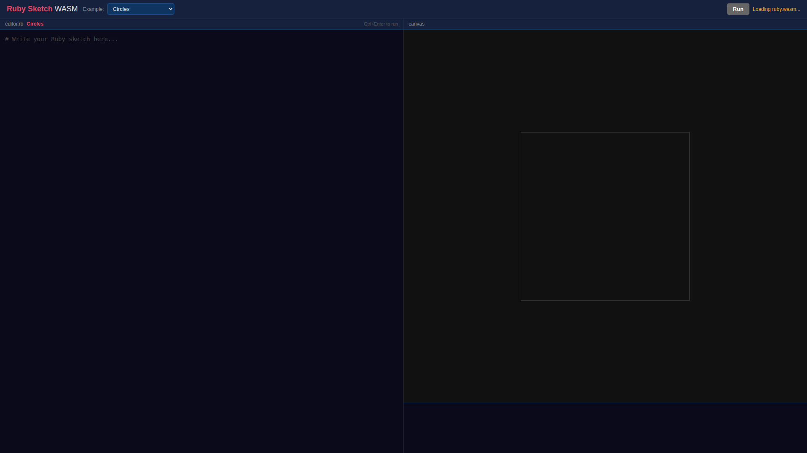

# browser-use CLI テスト結果

[browser-use CLI](https://docs.browser-use.com/open-source/browser-use-cli) を使って Ruby Sketch WASM の全9サンプルを自動操作・スクリーンショット撮影した結果です。

## 初期表示

Ruby WASM ロード前の状態。



## サンプル一覧

### 1. Circles

カラフルなボールが弾むアニメーション。


### 2. Rainbow Wave

虹色のサイン波アニメーション。


### 3. Particles

パーティクル噴水エフェクト。


### 4. Fractal Tree

再帰的に描画されるフラクタルツリー。


### 5. Game of Life

コンウェイのライフゲーム（セルオートマトン）。


### 6. Starfield

中心から星が飛び出す3D風アニメーション。


### 7. Interactive Paint

クリック&ドラッグで描画するインタラクティブペイント。


### 8. HSB Clock

HSBカラーモードを使ったアナログ時計。


### 9. Vector Boids

PVectorを使った群れシミュレーション（Boids）。


## テスト方法

```bash
# browser-use CLI インストール
uv pip install --system browser-use
browser-use install

# CDN リソースをローカルキャッシュ
mkdir -p /tmp/cdn-cache
curl -sL -o /tmp/cdn-cache/ruby-umd.js 'https://cdn.jsdelivr.net/npm/@ruby/wasm-wasi@2.6.2/dist/browser.umd.js'
curl -sL -o /tmp/cdn-cache/ruby-wasm.wasm 'https://cdn.jsdelivr.net/npm/@ruby/3.3-wasm-wasi@2.6.2/dist/ruby+stdlib.wasm'

# テストサーバー起動
cd docs/ruby-sketch-wasm
node test-server.cjs

# browser-use CLI で操作
browser-use open http://localhost:8767/
browser-use state
browser-use click <Run button index>
browser-use screenshot output.png
browser-use select <select index> "Rainbow Wave"
```
