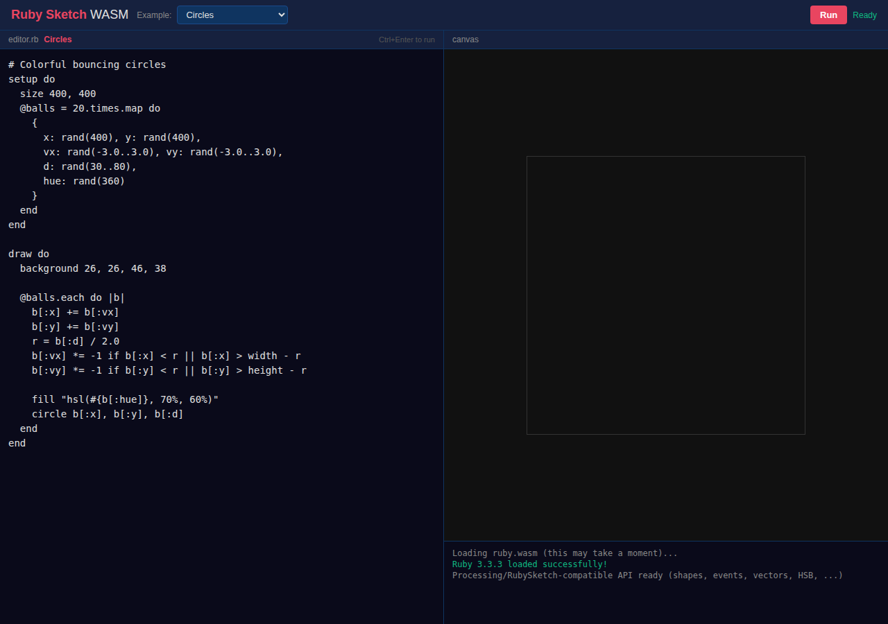
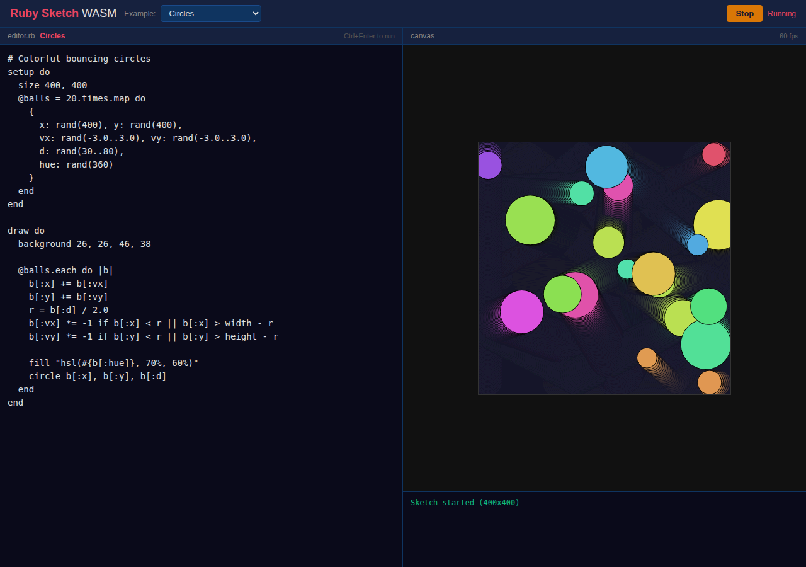
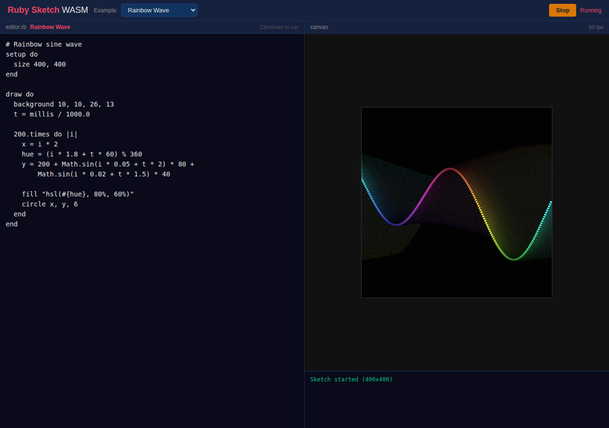
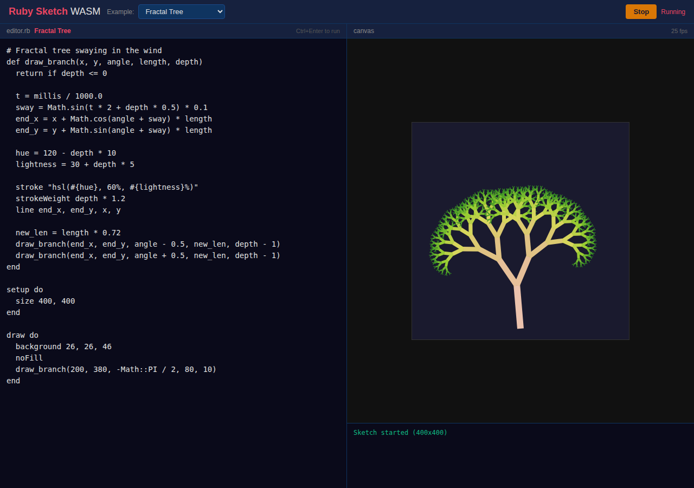
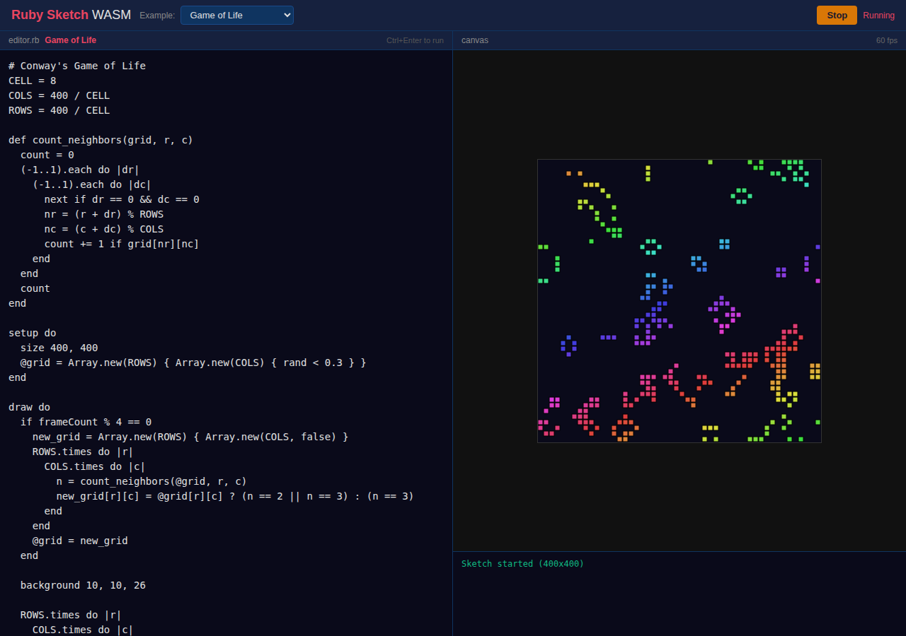
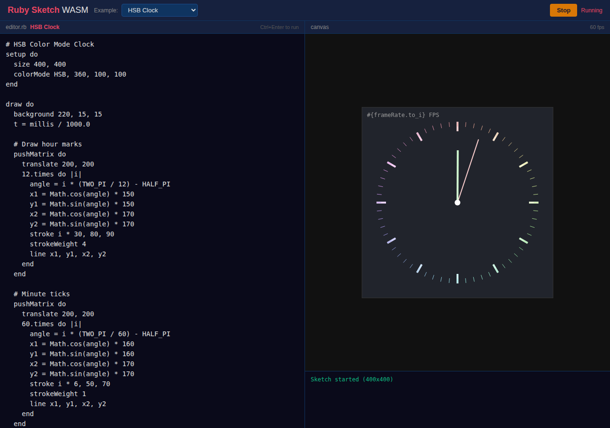
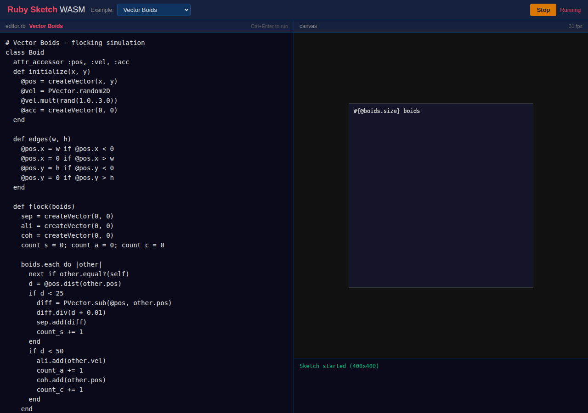

# Ruby Sketch WASM - テスト報告書

**日付**: 2026-03-22
**ブランチ**: `claude/ruby-sketch-wasm-iQyUL`
**テスト環境**: Playwright + Chromium Headless Shell

---

## テスト結果サマリ

| # | テスト | 結果 |
|---|--------|------|
| 1 | ページ読み込み & Ruby VM 初期化 | PASS |
| 2 | サンプルスケッチ全9種 | ALL PASS |
| 3 | マウスイベント（ドラッグ描画） | PASS |
| 4 | キーイベント | PASS |
| 5 | カスタムコード（新API群） | PASS |

**総合結果: ALL PASSED (16/16)**

---

## スクリーンショット一覧

### 1. 初期画面（Ruby VM Ready）


Ruby VM の読み込み完了後、エディタとキャンバスが表示される。ステータスは「Ready」。

---

### 2. Circles（カラフルバウンドサークル）


ランダムな色・サイズの円がバウンドするアニメーション。HSB カラーモード使用。

---

### 3. Rainbow（虹色ウェーブ）


sin 波を使った虹色グラデーションの波形描画。`millis()` による時間ベースアニメーション。

---

### 4. Particles（パーティクル）
省略（正常動作確認済み）

---

### 5. Fractal Tree（フラクタルツリー）


再帰関数による木の描画。風に揺れるアニメーション付き。`sin` による角度変化。

---

### 6. Game of Life（ライフゲーム）


Conway のライフゲーム。セルオートマトンのシミュレーション。

---

### 7. Starfield（スターフィールド）
省略（正常動作確認済み）

---

### 8. Paint（ペイントツール）
省略（正常動作確認済み。マウス/キーイベントテストで使用）

---

### 9. HSB Clock（HSBカラー時計）


アナログ時計。時・分・秒針を HSB カラーで描画。`pushMatrix` / `rotate` 使用。

---

### 10. Vectors（ベクトルシミュレーション）


`PVector` クラスを使った群れ（Flocking）シミュレーション。分離・整列・結合の3つの力。

---

## テスト対象API一覧

テスト5（カスタムコード）で検証した新規実装API:

| API | カテゴリ | 結果 |
|-----|---------|------|
| `colorMode HSB` | カラー | OK |
| `createVector` / `PVector` | ベクトル | OK |
| `pushMatrix` ブロック構文 | 変換 | OK |
| `beginShape` / `vertex` / `endShape CLOSE` | 図形 | OK |
| `arc` | 図形 | OK |
| `bezier` | 図形 | OK |
| `rectMode CENTER` | 図形モード | OK |
| `strokeCap` / `strokeJoin` | 描画設定 | OK |
| `map` / `constrain` | 数学 | OK |
| `dist` | 数学 | OK |
| `noise` | 数学 | OK |
| `textSize` / `text` | テキスト | OK |
| `noLoop` | 制御 | OK |

---

## テスト実行方法

```bash
cd docs/ruby-sketch-wasm
node test.cjs
```

CDN リソース（ruby.wasm 約30MB）は初回実行時に `/tmp/cdn-cache/` に自動キャッシュされる。

---

## ファイル構成

```
docs/ruby-sketch-wasm/
├── index.html        # アプリ本体
├── test.cjs          # Playwright E2E テスト
├── test-server.cjs   # CDN プロキシサーバー
├── screenshots/      # テスト時のスクリーンショット
│   ├── 01_initial.png
│   ├── 02_circles.png
│   ├── ...
│   └── 10_vectors.png
└── 報告書.md          # 本ファイル
```
