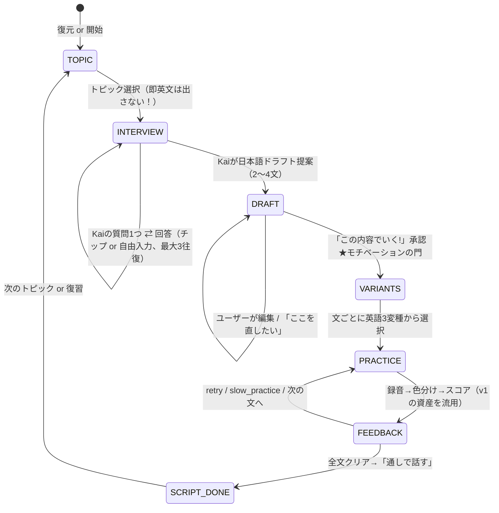

# eikaiwa-buddy v2 体験設計書（マスター承認用）

## 依頼内容（2026-07-08 マスター原文要約）

> 例えば左にある自己紹介ボタンを押した際、すぐにAIがワンフレーズ作成するのではなく、**ユーザーのコンテキストをAIに渡した上で内容のすり合わせから始めたい**。ユーザー自身が「**この文章をネイティブが英語化してくれるなら練習したい**」と思えるようなモチベーションを上げる体験設計をお願いします。ゲームではなく、英会話を高めるためのプランニングを。

## コンセプト：「英語より先に、言いたいことを作る」

日本人が英会話で詰まる根本原因は「英語力」の前に「**何を言うかが自分の中にない**」こと。
v1は「トピック→AIが即例文」だったので、出てくる英文は"誰のものでもない教科書例文"だった。
v2は **「自分の言葉の日本語ドラフトを共同編集で作る → 承認 → ネイティブ英語化」** に変える。
練習する英文が「自分の人生の言葉」になるので、練習の意味が自明になる。

## Before / After

| | v1（現状） | v2（提案） |
|---|---|---|
| トピックボタン押下 | **即** 英文1個が出る | Kaiが**日本語インタビュー**を開始（1問ずつ・最大3問） |
| ユーザーの関与 | 出された英文を読むだけ | 言いたい内容を答える→**日本語ドラフトを編集・承認** |
| 英文の出所 | AIの一般例文 | **自分が承認した内容**のネイティブ英語化 |
| 英文の形 | 1文固定 | 文ごとに**3変種から選ぶ**（シンプル/ネイティブ/こなれ） |
| 練習の単位 | 単発フレーズ | **マイスクリプト**（2〜4文の連続した自分の台本） |
| 積み上がるもの | スコアの数字 | **実戦で使える自分の台本**＋スコア |

## 体験フロー（ステートマシン）



## 会話モック（自己紹介の例・このトーンで実装する）

```
👤 [自己紹介] をタップ
🤖 Kai: 自己紹介いいね！誰に向けた自己紹介にする？
     [仕事の初対面] [海外の友達づくり] [オンライン英会話の先生] (自由入力欄)
👤 仕事の初対面
🤖 Kai: OK! 仕事、なんて紹介したい？（登録済み: エンジニア）
     [そのままでいい] [もう少し具体的に言いたい]
👤 もう少し具体的に → 「AIを使った開発ツールを作ってる」
🤖 Kai: いいね、それ絶対ウケるよ。じゃあこの内容で話すのはどう？
   ┌─ 日本語ドラフト（タップで直接編集できる）─────────┐
   │ こんにちは、カズです。                              │
   │ AIを使った開発ツールを作っているエンジニアです。     │
   │ 最近はAIエージェントの開発に夢中です。               │
   └───────────────────────────────┘
     [✅ この内容でいく!] [✏️ ここを直したい]
👤 ✅ この内容でいく!
🤖 Kai: 2文目、ネイティブならこう言うよ。どれで練習する？
     🅰 シンプル版: "I'm an engineer. I build AI developer tools."
        └ 今のレベルで言い切れる。まずはこれで十分伝わる
     🅱 ナチュラル版: "I'm an engineer working on AI-powered developer tools."
        └ working on が「今まさに取り組んでる」感を出す定番
     🅲 こなれ版: "I build developer tools that put AI to work."
        └ put A to work は「Aを活用する」の生きた表現
👤 🅱 を選択 → 🎙️ 練習ループへ（v1の録音・色分け・発音判定をそのまま使用）
```

## モチベーション設計の5原則（実装の判断基準にすること）

1. **自己関連性**: 練習素材は必ず「ユーザーの実生活の言葉」から作る。一般例文の即出しは禁止。
2. **承認の門**: 日本語ドラフトの「この内容でいく!」を必ず通す。承認前に英語を見せない。
3. **選べる英語**: 変種選択でレベルと好みの主導権をユーザーに渡す（やらされ感の排除）。
4. **資産の可視化**: 練習の成果は「使える台本（マイスクリプト）」として貯まる。数字だけにしない。
5. **軽さ**: インタビューは1ターン1質問・最大3問。尋問にしない。チップで答えられるように。

## ユーザーコンテキストの扱い

- `user_context` テーブルに **fact単位** で保存（例: job=エンジニア, hobby=猫・コーヒー, scene=海外カンファレンス）。
- 取得経路: (a)初回オンボーディング3問（スキップ可）、(b)インタビュー回答から `gemini-3.1-flash-lite` で自動抽出、(c)設定画面で編集可能。
- Kaiの全プロンプトに注入し、「登録済み: エンジニア」のように**使っていることを見せる**（覚えててくれてる感＝継続動機）。

## DB追加（migration 0002）※Codex事前レビュー反映済み

設計原則: **scriptとscript_sentenceを正規の練習対象にする**。sessionsはナビゲーション情報のみ。
**インタビュー状態はchat_historyから再構成しない**（chatは表示ログ、状態はversion付き構造化JSON）。

```sql
CREATE TABLE user_context (
  id INTEGER PRIMARY KEY AUTOINCREMENT,
  user_id TEXT NOT NULL REFERENCES users(id),
  fact_key TEXT NOT NULL, fact_value TEXT NOT NULL,
  source TEXT NOT NULL DEFAULT 'interview',  -- onboarding|interview|manual
  updated_at TEXT DEFAULT (datetime('now')),
  UNIQUE(user_id, fact_key)
);
CREATE TABLE scripts (
  id TEXT PRIMARY KEY, user_id TEXT NOT NULL REFERENCES users(id),
  topic TEXT NOT NULL, audience TEXT,
  status TEXT NOT NULL DEFAULT 'interview',  -- interview|draft|practicing|complete
  interview_json TEXT,  -- {version, turn_count, max_turns, last_question_ja, chips,
                        --  draft_sentences_ja, approved_at} 復元の正はここ
  created_at TEXT DEFAULT (datetime('now')), updated_at TEXT
);
CREATE TABLE script_sentences (
  id INTEGER PRIMARY KEY AUTOINCREMENT,
  script_id TEXT NOT NULL REFERENCES scripts(id),
  position INTEGER NOT NULL,
  ja_text TEXT NOT NULL,
  en_variants_json TEXT,      -- [{position, style:simple|natural|advanced, en, why_ja, traps}]
  en_selected TEXT,           -- 選択した英文（評価時のtargetの正）
  best_score INTEGER DEFAULT 0, practice_count INTEGER DEFAULT 0
);
-- sessions: script_id / phase(interview|draft|variants|practice|feedback) /
--           active_sentence_position のみ追加（状態実体は持たない）
-- attempts: script_sentence_id 列を追加（score/best_score/practice_count更新を一括処理）
```

- user_context抽出はインタビュー応答(A-v2)の `extracted_facts` を同時保存（追加API呼び出しをしない）
- 二重送信対策: busy中のクリック防止 + サーバー側で phase と turn_count 上限を検証

## プロンプト設計変更（worker/prompts.ts）

**(A-v2) インタビュー/ドラフトモード** `gemini-3.5-flash`（responseSchema必須）:
```
あなたは英会話コーチKai。今は「内容すり合わせ」フェーズ。
絶対規則: ユーザーが日本語ドラフトを承認するまで英語を一切出力しない。
- 1ターンに質問は1つ。選択肢チップ(2-3個)を必ず添える。
- 質問は最大{remaining}回。user_context {facts} を活用し、使う時は「登録済み: X」と見せる。
- 十分な材料が集まったら2〜4文の日本語ドラフトを提案。文は短く、話し言葉で。
出力JSON: { "message_ja", "chips": string[] | null,
  "draft": { "sentences_ja": string[] } | null,
  "extracted_facts": [{"key","value"}] | null }
```

**(A2-batch) 英語変種生成**（ドラフト承認後、**全文を1回のAPI呼び出しで一括生成**。文ごと呼び出し禁止＝承認直後の待ち・コスト・失敗点を削減）:
```
承認済みの日本語ドラフト（2〜4文）を話者本人の言葉として英語化する。各文に3変種:
simple(現レベル{level}で言い切れる) / natural(ネイティブの定番) / advanced(こなれ表現)。
各変種に why_ja(なぜ自然か1文) と、日本人が発音注意すべき単語(traps)を付ける。
出力JSON: { "sentences": [{"position", "ja_text",
  "variants": [{"style","en","why_ja","traps":[{"word","tip_ja"}]}]}] }
```
- 生成失敗時は「生成失敗・再試行」をUIに明示（古い英文の再利用等の成功偽装fallback禁止）
- TTSは選択された英文だけ遅延実行（全変種分の先行生成禁止）

**(B) 発音評価は変更なし**。ただし **target文はclient送信の文字列を信用せず**、clientは `sentence_id + style` を送り、サーバーが `script_sentences.en_selected` と一致検証して評価対象を決定する。

## UI変更

- 左: コーチチャット（既存）に**チップ回答**を追加。
- 中央ステージをフェーズで切替: インタビュー(チャット中心) → **ドラフトカード**（直接編集できるtextarea+「この内容でいく!」大ボタン） → **変種3枚カード**（why_ja付き、タップ選択） → 練習（既存UI） 。
- 右カラムに **マイスクリプト**: 台本一覧、文ごとの习熟バッジ（🟢80+/🟡60+/⚪未）、「通しで話す」ボタン。今日のスコアより上に置く（資産>数字）。
- トピックボタンの文言を「自己紹介**を一緒に作る**」的なニュアンスに変更。

## 実装フェーズ（Codex委任単位・実装順もこの通りに）

- **P1a**: migration 0002 + shared types + payload設計（scriptを正規練習対象にする基盤）
- **P1b**: interview/draft APIとUI・リロード復元・「承認前に英語が見えない」のテスト
- **P1c**: batch変種生成 + 変種選択 + selected sentence を既存practiceへ接続
- **P1d**: attemptにscript_sentence_id接続、best_score/practice_count更新
- **P1e**: 実Gemini E2E（構造assert中心）+ REPORT + yunomi
- **P2（資産化・P1承認後）**: マイスクリプト帳UI / 通しで話すモード / オンボーディング3問 / 復習導線

### E2E方針（フレーク対策・Codexレビュー反映）
- 自然文の完全一致assertは禁止。**構造で見る**: チップが2〜3個ある / 承認前に英語が存在しない / ドラフトtextareaが出る / 承認後にvariantが3つ / 選択後に録音UIが出る
- 例外として「登録済み」表記だけはプロンプトで固定し `/登録済み/` をassert（事前にcontext登録した上で）
- workers:1・タイムアウト長め・テストごとに新規cookie + local D1リセット（モックではなくDB初期化）
- リロード復元E2Eは3本に分割: ①インタビュー途中 ②ドラフト編集中 ③変種表示中
- 証跡はviewportスクショ中心（sticky header問題の再発防止）

## 受け入れ条件（P1）

1. トピックをタップして**英文が即出たら不合格**。必ず日本語の質問から始まる
2. インタビューは1ターン1質問・チップ付き・最大3問でドラフトに到達する
3. ドラフトは編集でき、「この内容でいく!」を押すまで英語が出ない
4. 承認後、文ごとに3変種+why_ja+発音trapsが表示され、選んだ文で練習できる
5. 練習は既存の録音→色分け→スコアがそのまま動く（fixture E2E含む）
6. リロードでインタビュー途中・ドラフト編集中・変種選択中いずれの状態も復元される
7. user_contextがKaiの発話に反映される（E2Eで「登録済み」表示を確認）
8. モデルは引き続き gemini-3.5-flash / 3.1-flash-lite / 3.1-flash-tts のみ。実API E2E・モック禁止・fallback偽装禁止は継続
9. build/lint/vitest/Playwright全緑 + スクショ証跡 + REPORT.md + yunomi承認

## マスターへの確認ポイント（ここだけ見ればOK）

- **Q1. インタビューの深さ**: 「最大3問」で軽さ優先にした（尋問化防止）。もっと深掘り派？→ そのままでOKなら追加判断不要
- **Q2. 変種は3つ**（シンプル/ナチュラル/こなれ）で多すぎない想定。2つに絞る？
- **Q3. P1→P2の分割**: まずP1（すり合わせ体験）だけ完成させて触ってもらう進め方でいい？
