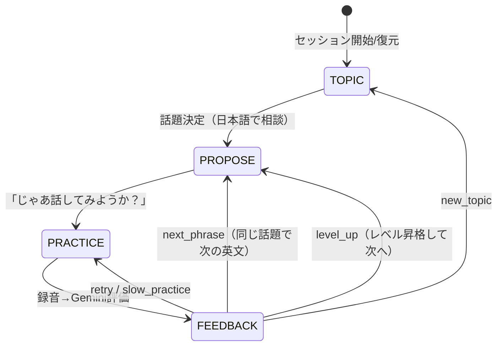

# eikaiwa-buddy 実装計画書（発注仕様）

## 依頼内容（原文要約）

Gemini（**3.5 flash / 3系flash / 3系flash liteのみ**）内蔵の英会話練習アプリ。
- 日本人は「外人と何を話せばいいかわからない」→ まず**日本語で話題を一緒に考える**
- 「だったらこういう英文がいいよ」と英文を提案
- 「じゃあ話してみようか？」→ マイクボタンで録音
- 英語として聞き取れたかどうかを**単語ごとに色分け表示**、発音チェックもGemini APIだけで実現
- 録音音声を評価して「繰り返し練習」or「次の文章へ」を判断する**Agenticな進行**
- フルCloudflare Workersスタック + D1で進捗管理、リロード復元

## 技術調査結果（設計根拠・2026-07-07確認済み）

- `gemini-3.5-flash`: **GA**。音声入力（audio understanding）対応 ← メイン脳
- `gemini-3.1-flash-lite`: **GA**。ASR品質向上を明記 ← 軽量処理用
- `gemini-3.1-flash-tts`(preview): お手本読み上げ用（3系flashの範囲内）
- **音声入力対応フォーマットは WAV / MP3 / AIFF / AAC / OGG Vorbis / FLAC のみ。MediaRecorderのWebM/Opusは非対応** → クライアントで `AudioContext.decodeAudioData` → **16kHz mono WAV** に変換してから送る（必須）
- インライン音声はリクエスト20MBまで（16kHz mono WAVなら数十秒発話で余裕）。音声は32トークン/秒
- 発音専用MLは不要という結論: Geminiの音声理解に「意味補正なしverbatim書き起こし」+「単語別評価」を構造化出力（responseSchema）で強制すれば、単語レベルの聞き取り判定・発音アドバイスが取れる

## UX / Agenticフロー（ステートマシン）



1. **TOPIC**: コーチAI「Kai」が日本語で挨拶し、話題候補3つ提案（例: 週末の予定/好きな食べ物/仕事）。ユーザーは選ぶ or 自由入力（日本語OK）
2. **PROPOSE**: 話題に対して「だったらこう言うといいよ」→ 英文+日本語訳+使いどころ解説+発音注意点。TTSボタンでお手本再生
3. **PRACTICE**: 大きなマイクボタン。押して録音→もう一度押して停止（最長30秒）。波形表示
4. **FEEDBACK**: 単語ごとの色分け（下記）+発音アドバイス（日本語）+スコア
5. **エージェント判断**: 評価結果に `next_step` が含まれ、UIが次の行動を提案（ワンタップで遷移）

### 色分け仕様（聞き取り可視化）
ターゲット英文の各単語を、Geminiのverbatim書き起こしとの**クライアント側アライメント**（正規化: 小文字化・約物除去・数字/短縮形の正規化 → LCSベースの単語diff）+ Geminiの単語別判定を突き合わせて表示:
- 🟢 緑: 正しく聞き取れた（verdict=ok）
- 🟡 黄: 曖昧・別の音に近い（verdict=unclear、heard_as表示 例: "rice → lice に聞こえた"）
- 🔴 赤: 聞き取れなかった/脱落（verdict=wrong|missing）
- 単語タップで個別アドバイス（日本語）をポップオーバー表示

## レベル調整表（事前設計・D1に状態保存）

| Lv | 目安 | 英文の長さ | 文法範囲 | 例 |
|---|---|---|---|---|
| L1 | 入門 | 3〜5語 | be動詞・定型句 | "I like coffee." |
| L2 | 初級 | 6〜8語 | 現在/過去形 | "I went to Shibuya last weekend." |
| L3 | 初中級 | 8〜12語 | 接続詞・理由 | "I like cats because they are independent." |
| L4 | 中級 | 12語〜 | 意見・比較・仮定 | "If I had more time, I would travel abroad." |
| L5 | 上級 | 自由会話 | AIが追い質問して続ける | フリートーク |

**昇降格ルール（コードで実装、AI任せにしない）**:
- 直近5アテンプトの平均 pronunciation_score ≥ 80 → 昇格提案（`next_step: level_up`）
- 平均 < 50 が3回連続 → 現レベル維持+短い英文に易化
- ユーザーが手動でレベル変更も可能（設定画面）

## Geminiプロンプト設計（このまま実装に使うこと）

### (A) コーチ会話: `gemini-3.5-flash`（TOPIC/PROPOSE共通、responseSchemaでJSON強制）
システムプロンプト（要旨、実装時はこの内容を英語で厳密化してもよいが出力は日本語）:
```
あなたは日本人向け英会話コーチ「Kai」。明るく、絶対に相手を否定しない。
役割: (1)日本語で雑談しながら話題を見つける (2)話題が決まったら学習者レベル{level}に
合った英文を1つ提案する。
制約: 英文はレベル表{level_table}の語数・文法範囲を厳守。提案時は必ず
「なぜこの表現が自然か」を日本語で1〜2文添える。カタカナ発音表記は使わない。
発音注意点はIPAではなく「日本人が間違えやすいポイント」を日本語で書く(例: thは舌を軽く噛む)。
出力JSON: { "message_ja": string, "topic_suggestions": string[] | null,
  "phrase": { "en": string, "ja": string, "why_ja": string,
              "pronunciation_tips_ja": string[] } | null,
  "state": "topic" | "propose" }
```

### (B) 発音・聞き取り評価: `gemini-3.5-flash`（audio + text、1コールで完結）
入力: 録音WAV（inlineData, audio/wav）+ ターゲット英文 + レベル。
```
You are a strict but encouraging English pronunciation evaluator for Japanese learners.
The learner tried to say: "{target}"
Step 1 - VERBATIM transcription: write exactly what you hear, do NOT autocorrect
to the target sentence. If a word sounds distorted, write the closest sounds you hear.
Step 2 - Word-level judgement for each word of the target sentence:
verdict ok|unclear|wrong|missing, what it sounded like (heard_as),
and Japanese advice focusing on typical Japanese-speaker issues
(r/l, th, v/b, si/shi, final consonants, katakana-vowel insertion like "gu-do" for "good").
Step 3 - Scores 0-100: pronunciation (segment accuracy), fluency (speed/pauses),
prosody comment in Japanese (stress & intonation).
Step 4 - next_step decision: retry (score<60), slow_practice (same phrase, chunked,
50<=score<70), next_phrase (>=70), level_up (only if instructed that recent average>=80).
Never leave fields empty. Respond ONLY with the JSON schema provided.
```
responseSchema:
```json
{ "verbatim": "string",
  "words": [{ "target_word": "string", "verdict": "ok|unclear|wrong|missing",
              "heard_as": "string", "advice_ja": "string" }],
  "pronunciation_score": 0, "fluency_score": 0,
  "prosody_comment_ja": "string", "overall_advice_ja": "string",
  "next_step": "retry|slow_practice|next_phrase|level_up" }
```
- 無音・非英語音声の場合は `verbatim:"(no speech detected)"`、全単語missingになることをプロンプトで明示し、UIは「録音できてないかも？マイクを確認してね」を表示（**取れていないのに成功扱いにするfallback禁止**）

### (C) お手本TTS: `gemini-3.1-flash-tts`（preview）
- 通常速度とスロー（slow_practice時は "Say slowly, clearly separating each word:" プリアンブル or speaking_rate指定）
- TTSが失敗/クォータ切れの場合はエラーをUIに明示表示（勝手にブラウザTTSへ差し替えて隠蔽しない。ブラウザTTSを使う場合は「ブラウザ音声で再生中」と明示ラベル）

### (D) 軽量処理: `gemini-3.1-flash-lite`
- 話題候補の再生成、フレーズ履歴の要約（セッション復元時のコンテキスト圧縮）など低コスト処理

## アーキテクチャ

```
eikaiwa-buddy/
├── package.json         # npm, vite, react19, hono, wrangler, vitest, playwright
├── wrangler.jsonc       # assets + D1 (DB) + GEMINI_API_KEY (secret / .dev.vars)
├── vite.config.ts
├── migrations/0001_init.sql
├── src/
│   ├── worker/
│   │   ├── index.ts     # Hono ルーティング
│   │   ├── gemini.ts    # Gemini API クライアント（fetch直、SDK不要）
│   │   └── prompts.ts   # 上記プロンプト定義
│   ├── client/          # React UI (Chat/Practice/Progress)
│   │   └── audio/       # 録音 + WAVエンコーダ(16kHz mono)
│   └── shared/          # 型・アライメントdiff・レベルエンジン（純関数）
├── e2e/                 # Playwright（fake mic + 実API統合）
├── fixtures/            # E2E用の英語発話WAV（自作: `say`コマンド等で生成）
└── tests/               # vitest
```

- **APIキーはWorkers側のみ**（`.dev.vars` / `wrangler secret put GEMINI_API_KEY`）。クライアントに一切露出させない。キーは `../face-crop-app/.env.local` の `GEMINI_API_KEY` をコピーして `.dev.vars` に置く（.gitignore必須）
- Gemini呼び出しはWorkersから `generativelanguage.googleapis.com` へfetch（`x-goog-api-key`ヘッダ + responseSchema付きgenerateContent）

### D1スキーマ
```sql
CREATE TABLE users (
  id TEXT PRIMARY KEY,             -- uuid (httpOnly cookie "eb_uid")
  level INTEGER DEFAULT 1,
  created_at TEXT DEFAULT (datetime('now'))
);
CREATE TABLE sessions (
  id TEXT PRIMARY KEY, user_id TEXT NOT NULL REFERENCES users(id),
  topic TEXT, state TEXT NOT NULL DEFAULT 'topic',   -- topic|propose|practice|feedback
  current_phrase_json TEXT,                          -- 提案中フレーズ
  chat_history_json TEXT,                            -- コーチ会話の復元用
  created_at TEXT, updated_at TEXT
);
CREATE TABLE attempts (
  id INTEGER PRIMARY KEY AUTOINCREMENT,
  session_id TEXT NOT NULL REFERENCES sessions(id),
  phrase_en TEXT NOT NULL,
  verbatim TEXT, words_json TEXT,
  pronunciation_score INTEGER, fluency_score INTEGER,
  next_step TEXT, created_at TEXT DEFAULT (datetime('now'))
);
CREATE TABLE level_history (
  id INTEGER PRIMARY KEY AUTOINCREMENT,
  user_id TEXT NOT NULL, from_level INTEGER, to_level INTEGER, reason TEXT,
  created_at TEXT DEFAULT (datetime('now'))
);
```

### API（Hono）
- `POST /api/session/start` … cookie発行/復元。**進行中セッションがあれば状態・会話履歴・現在フレーズごと返す（リロード復元の要）**
- `POST /api/chat` … コーチ会話（A）。state遷移をサーバー側で管理しD1に保存
- `POST /api/attempt` … WAV(multipart) + phrase → Gemini評価（B）→ attempts保存 → 昇降格エンジン適用 → 評価+next_step返却
- `POST /api/tts` … フレーズ→音声（C）。audio/wav or mp3で返す
- `GET /api/progress` … レベル、直近スコア推移、練習回数（進捗グラフ用）

## テスト・受け入れ条件（全部満たすまで完了禁止）

1. `npm run build` 成功、型エラー0、`npm run lint` パス
2. **vitest**: WAVエンコーダ（サンプルレート変換・ヘッダ検証）、単語アライメントdiff（正規化・欠落・置換ケース）、昇降格エンジン（境界値）
3. **Playwright E2E（実Gemini API統合。APIモック禁止）**:
   - Chromium起動オプション `--use-fake-device-for-media-stream --use-file-for-fake-audio-capture=fixtures/hello.wav` で**本物の録音フロー**を通す（fixtures は macOS `say -v Samantha` などで自作した英語音声）
   - セッション開始→話題選択→英文提案→録音→色分けフィードバック表示→next_step遷移、まで一気通貫
   - リロードしてセッション・レベル・履歴が復元されること
   - スクショを `.artifacts/eikaiwa-buddy/` に保存（各画面 + モバイル幅375px）
4. **実音声での手動確認**: fixtureで「良い発音」と「わざと崩した発音（日本語なまり）」の2種を用意し、色分け・スコアが実際に差が出ることを確認して証跡を残す
5. スクショを自分の目で確認: レイアウト崩れ・はみ出し・文字化けなし
6. `wrangler d1 migrations apply --local` 成功、dev環境でAPI一式実動作
7. Gemini呼び出し失敗時（キー無効・レート制限）はUIにエラーを明示。成功したフリをするfallback実装は一切禁止

## 禁止事項
- Gemini以外のAIモデル/音声認識サービス（Whisper等）の使用（ユーザー指定: Gemini 3.5 flash / 3系flash / 3系flash liteのみ。TTSも3系flash TTS）
- APIキーのクライアント露出・コミット
- E2EでのGemini APIモック（実APIで通す。コストは気にしない）
- エラー時に成功を装うfallback
