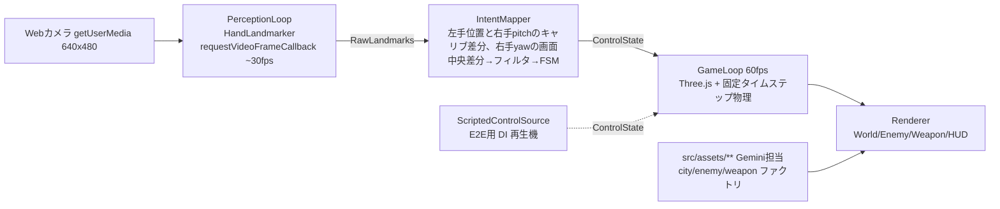

# Webcam VR FPS（仮称: AERO HAND）実装計画書

Created: 2026-06-13
Branch: main（このリポジトリは main 直 dir 追加方式。worktree 不要とユーザー指示済み）
Status: Review
Project-Type: web（フロントエンドのみ、サーバー不要）
担当: **Codex (gpt-5.5) @ herdr p_46 = 実装担当（この文書を上から順に全消化）**
協力: **Gemini (agy) @ herdr p_47 = 3Dアセット担当**（`webcam-vr-fps/ASSETS_PLAN.md` 参照。`src/assets/**` は Gemini の所有領域。Codex は編集禁止）
部長: herdr p_45（報告先）

## ユーザー原文（改変禁止・追記のみ）

### 初回依頼
> やりたいのは、完全webカメラだけで動作するVR風FPSです。
> 顔の向きに対応し、
> 左手の手で前後左右移動と手を広げた時にアイアンマンみたいにジェットを噴射して飛ぶこともできます。
> 右手は武器です。
> 顔で視点移動です。
> 新しいインターフェースですが、君の知能なら理解して実装まで落とし込めると思います。その内部設計までお願いします。

### 追加指示・フィードバック
- 2026-06-13: 「%47はagy=gemini 3.5 flashを立ち上げたので、ビル群や敵の造形をお願いしてください。3D作成で言えばgeminiの方が上です。アセット用の計画書を分けて書いて、Geminiに渡してください。」
- 2026-06-13: 「mainでdir切って作業してほしい。worktreeは不要。」
- 2026-06-13 yunomiレビュー(PLAN.md): 「プレイしないとわからない。報告書よりも動く実物。」→ decision: request_changes
- 2026-06-13 yunomiレビュー(ASSETS_PLAN.md): 「ゲームの報告なのに1つもビジュアルなのはNGです。」→ decision: request_changes
- 2026-06-13: 「あと、今エリア外に飛ぶとゲームオーバーやめて。」
- 2026-06-13: 「単に天井にぶつかればいい。」
- 2026-06-13 実機プレイ報告: 「グーにしていても基本的に空に飛び上がります。」（開掌判定の誤発動バグ）
- 2026-06-13 実機プレイ報告: 「顔の向きが反転した方が良いです。あと、ゲームオーバーの条件が未だに不明です。攻撃を受けてる？それとも着地ダメージがある？」
- 2026-06-13 訂正: 「あ、ごめん、顔は上下だけ反転ですね。」（反転は pitch のみ。yaw は現状維持）
- 2026-06-13 実機プレイ報告: 「顔で首振り辞めます。右でだけで回りたいです。顔の向きはもう見ないで。あと、HP性一旦やめましょう。とにかくまずは敵を倒せるか？を検証したいです。ちなみにたまが当たらなくなっている気がします。すでに。」
- 2026-07-24: 「君がE2Eでテストして完成させて。」
- 2026-07-24: 「E2Eをどれだけ実在の人間に近づけられるかが焦点です。そこで本気を出して。」

### 期待される振る舞い（追加・テスト必須）
- [x] エリア外（上空・水平境界）に飛んでもゲームオーバーにならず、天井/境界に衝突して止まる → E2E: `e2e/boundary.spec.ts`
- [x] グー（握り拳）ではジェットが発動せず、明確な開掌のみで発動する → unit: `tests/gesture-fsm.test.ts`（拳/開掌の現実的ランドマークで検証）
- [x] 顔向きは視点に使わず、右手だけで視点回転する → E2E: `e2e/view-control.spec.ts`
- [x] HP/プレイヤー死亡はいったん無効化し、敵撃破検証に集中する → E2E: `e2e/gameloop.spec.ts`
- [x] 弾が敵に当たりやすいよう、右手視点回転 + 中央射撃 + ヒット補助で敵撃破を安定検証する → E2E: `e2e/weapon.spec.ts`

### 参考イメージ
ユーザー提示のスクショ: サイバーパンク夜景都市（ネオンビル群・霧・空中リング）＋左手首ホロHUDパネル＋右手SF銃のFPS視点。この雰囲気を目標とする。

## 期待される振る舞い（テスト必須）

ここに書いた振る舞いは、すべて E2E または unit テストとして実装されていなければ完了と認めない。

- [x] 右手を動かすと視点（カメラ）が回る。顔向きは視点に使わない → E2E: `e2e/view-control.spec.ts`
- [x] 左手をニュートラル位置から上下左右に動かすとプレイヤーが前後左右に移動する → E2E: `e2e/movement.spec.ts`
- [x] 左手を開く（5指を広げる）とジェット噴射で上昇し、閉じると重力で降下する → E2E: `e2e/jet-flight.spec.ts`
- [x] 右手で視点を合わせ、ピンチ（親指+人差し指）で画面中央へ射撃され、敵にヒットすると撃破される → E2E: `e2e/weapon.spec.ts`
- [x] トラッキングロスト時（手や顔が映らない）に入力がニュートラルへ減衰し、暴走しない → unit: `tests/tracking-loss.test.ts`
- [x] ジェスチャー判定（開掌・ピンチ）はヒステリシスを持ちチャタリングしない → unit: `tests/gesture-fsm.test.ts`
- [x] フィルタ・スティック写像・yawレート変換が仕様通り → unit: `tests/mapping.test.ts`
- [x] HP/ゲームオーバーは無効。敵弾が出てもプレイヤーは死なず、敵撃破検証を続けられる → E2E: `e2e/gameloop.spec.ts`

## 背景・目的

WebXR デバイス不要、**Webカメラ1台だけ**で VR 風の没入 FPS を実現する新インターフェースの実証。現在の検証スコープは、左手=移動+飛行、右手=視点回転+武器。顔向きは視点制御に使わない。

## 技術スタック

- Vite + TypeScript + Three.js（このモノレポの標準構成に準拠）
- `@mediapipe/tasks-vision`（HandLandmarker、GPU delegate）
- テスト: vitest（unit）+ Playwright（E2E）
- パッケージマネージャ: npm。`webcam-vr-fps/` 直下で完結。サーバー・ビルド以外の外部依存なし

## アーキテクチャ（データフロー）



Perception（30fps）と GameLoop（60fps）は分離し、GameLoop は常に最新の ControlState を参照する（latest-sample 方式）。

## 内部設計

### ディレクトリ構成

```
webcam-vr-fps/
  index.html            # メインゲーム
  assets-preview.html   # Gemini 用アセット単体ビューア（Gemini が作る）
  vite.config.ts / tsconfig.json / package.json
  src/
    main.ts             # 起動・権限UI・キャリブ画面・DI 切り替え
    perception/
      camera.ts         # getUserMedia ラッパ（セルフィーミラー表示）
      landmarker.ts     # MediaPipe 初期化・detectForVideo ループ
    control/
      types.ts          # ControlState / ControlSource インターフェース
      intentMapper.ts   # ランドマーク → ControlState（純関数中心）
      oneEuro.ts        # One Euro フィルタ（純実装）
      gestureFsm.ts     # ヒステリシス付き状態機械（開掌/ピンチ）
      calibration.ts    # ニュートラル記録・再キャリブ
      scriptedSource.ts # E2E 用: JSON タイムラインを再生する ControlSource
    game/
      loop.ts           # 固定タイムステップ、debugState() 公開
      player.ts         # 移動・重力・ジェット物理
      weapon.ts         # hitscan・連射レート・トレーサー
      enemies.ts        # スポーン・簡易AI・敵弾トレーサー
      hud.ts            # 左手首ホロパネル + クロスヘア + 燃料/ターゲット数
      world.ts          # シーン構築（assets ファクトリを注入）
      placeholders.ts   # Gemini 納品までの仮ジオメトリ（contract 準拠）
    assets/             # ★ Gemini 所有。Codex は contract.ts 以外編集禁止
      contract.ts       # ★ Codex が Step 0 で最初に作成（下記仕様）
      city.ts enemy.ts weapon.ts index.ts   # Gemini が実装
  e2e/  tests/  fixtures/
```

### ControlState（制御信号の正規化インターフェース）

```ts
// src/control/types.ts
export interface ControlState {
  tracking: { leftHand: boolean; rightHand: boolean }
  view: { yawRate: number; pitch: number }   // yawRate: -1..1（レート制御）, pitch: rad 絶対値
  move: { x: number; z: number }             // -1..1 仮想スティック（x=ストレイフ, z=前後）
  jet: { active: boolean; thrust: number }   // 開掌で active、thrust 0..1
  aim: { x: number; y: number }              // -1..1 クロスヘアの画面内オフセット
  fire: boolean                              // ピンチ ON/OFF（ヒステリシス済み）
}
export interface ControlSource {
  start(): Promise<void>
  latest(): ControlState
  dispose(): void
}
```

本番は `PerceptionControlSource` を使う。E2E は二層構成とし、`?source=script&script=/fixtures/<name>.json` の `ScriptedControlSource` はゲーム側の高速な回帰確認にだけ使う。完成判断の中心は、実在する人の手画像から構成したY4MをGoogle Chromeのカメラ入力へ渡し、`getUserMedia → HandLandmarker → IntentMapper → GameLoop` を迂回せず通す `human-camera` project とする。

### 顔 → 未使用

顔向きは視点制御に使わない。現スコープでは FaceLandmarker を起動せず、ControlState にも顔 tracking を持たない。

### 左手 → 移動 + ジェット（HandLandmarker）

- 手の同定: `handedness` ラベル使用。**注意**: セルフィーミラー表示時のラベル反転を必ず実機で確認し、`landmarker.ts` の非ミラー入力補正に結論を残すこと。
- パーム中心 = landmark 0, 5, 17 の平均（正規化画像座標）。
- 非ミラー入力の左手パーム中心とキャリブ位置の差分 → 仮想スティック:
  - 上方向偏差 = 前進（z+）、下 = 後退、左右 = ストレイフ。
  - ユーザーが身体の右へ動かすとraw xは減少するため、raw x減少は正のストレイフx（ゲーム内の右）へ写像する。
  - deadzone 0.05、サチュレーション 0.22、間は smoothstep。
- **開掌判定（ジェット）**: 親指を除く4指それぞれで `distance(tip,wrist) > distance(PIP,wrist) * 1.15` を満たすと伸展扱い。4指中4指伸展で ON、2指以下で OFF、3指は前状態維持のヒステリシス FSM。ON で `jet.active=true, thrust=1`。拳は score 0 になり発動しない。
- ジェット物理: 上向き推力 18 m/s²（重力 9.8 を上回る）、燃料最大 3.5 秒、接地中に 2 倍速回復。空中では move 入力で水平機動。HUD に燃料ゲージ。

### 右手 → 視点 + 武器

- 右手パーム中心の画面中央からの水平差分 → `view.yawRate`、垂直差分 → `view.pitch`。どちらも既存deadzone内ではゼロ、中央から離れるほど速くなる。右手だけで視点を回す。
- 弾は画面中央方向へ撃つ。右手で視点を合わせてからピンチ射撃する設計にし、実機で「当たらない」体感を減らす。
- **ピンチ射撃**: 親指先(4)と人差し指先(8)の距離 /（手スケール基準）が ON < 0.35 / OFF > 0.48 のヒステリシス。fire 中は 8 発/s の hitscan。レイは カメラ位置 → クロスヘア方向。ヒット時: 敵 onHit()、敵耐久 -1（3 発で撃破）、スコア加算。
- 発射演出は assets の `WeaponViewModel.onFire()` を呼ぶ。

### トラッキングロスト処理

各部位 0.3 秒の grace period → 以降、該当信号を 200ms かけてニュートラルへ線形減衰。`fire` は即 false。復帰したら即反映。画面端に「LEFT HAND LOST」等の警告表示。

### キャリブレーション

起動時オーバーレイ:「左手を胸の前に、右手を画面中央に置いてください」→ 両手が 2 秒間安定検出されたら、左手中心・右手中心・手スケール基準を記録して開始。右手の位置はyaw/pitch中立へ使わず、画面中央を両方の中立として使う。`R` キーで再キャリブ。

### HUD 操作ガイド

校正完了直後にCONTROLS panelを展開し、8秒後に自動で折りたたむ。`?`ボタンはクリック、タップ、キーボード操作で開閉できる。左手の移動・開掌jet、右手の画面中央neutral・yaw・pitch・pinch fire、`R`再校正を、代替テキスト付きの生成済みPNG hand/direction iconsで示す。照準は常に画面中央であり、HUDは`aim`による表示移動をしない。

### ゲームコンテンツ（v1 スコープ）

- ネオン都市（assets/city）を飛び回り、湧いてくる敵ドローン（assets/enemy）を撃つスコアアタック。
- 敵 AI: プレイヤーへ緩く接近 + 2 秒ごとに発光トレーサー弾を発射。ただし HP/死亡は一旦無効化し、敵撃破検証を優先する。
- 落下/着地ダメージは存在しない。現スコープではプレイヤーのゲームオーバー条件も存在しない。
- HUD: 左手首追従ホロパネル（ターゲット数 / 燃料 / スコア / レーダー）+ 中央クロスヘア。参考イメージのテイストに寄せる。

### アセット契約（src/assets/contract.ts — Step 0 で Codex が作成・コミット）

```ts
import * as THREE from 'three'

export interface CityAsset {
  group: THREE.Group
  colliders: { min: THREE.Vector3; max: THREE.Vector3 }[]  // ビル衝突用 AABB
  update(dt: number, elapsed: number): void                 // ネオン明滅等
}
export interface EnemyAsset {
  group: THREE.Group
  hitRadius: number
  update(dt: number, elapsed: number): void  // ホバー・回転アニメ
  onHit(): void                              // 被弾フラッシュ
  onDestroy(): Promise<void>                 // 撃破演出（完了後 remove 可能）
  reset(): void                              // プール再利用用に状態リセット
}
export interface WeaponViewModel {
  group: THREE.Group          // カメラに子付け
  muzzle: THREE.Object3D
  onFire(): void
  update(dt: number): void
}
export type CityFactory = (seed: number) => CityAsset
export type EnemyFactory = () => EnemyAsset
export type WeaponFactory = () => WeaponViewModel
```

- Gemini が `city.ts / enemy.ts / weapon.ts / index.ts` をこの契約で実装する（詳細は `ASSETS_PLAN.md`）。
- Codex は納品まで `game/placeholders.ts` の仮実装（同契約）で全機能を完成させ、納品後 import 先を `src/assets` に切り替えるだけで統合できるようにする。
- 契約変更が必要になったら、変更案を `herdr agent send p_47 '[p_46] contract変更提案: ...'` で Gemini に直接連絡し、両計画書も更新すること。

## テスト戦略（t-wada TDD、モック/スタブ禁止）

1. **unit (vitest)**: `oneEuro.ts` / `gestureFsm.ts` / `intentMapper.ts` の写像（スティック・yawレート・伸展スコア・ピンチ）/ トラッキングロスト減衰 / 燃料系。すべて純関数・純クラスとして実装し、先にテストを書く（RED→GREEN）。
2. **Scripted E2E (Playwright)**: `ScriptedControlSource` を DI して実ゲームを起動し、`window.__game.debugState()`（プレイヤー座標・カメラ姿勢・敵数・敵撃破・スコアを返す）でゲーム側の回帰を高速に確認する。この層だけでは本番認識経路の証明としない。
3. **Human-camera E2E (Playwright + Google Chrome)**: `e2e/fixtures/human-hands.y4m` をChromeのカメラとして注入し、`source=script` を使わず、両手校正、校正後CONTROLS panelの展開と8秒後の自動折りたたみ、拳での誤発火なし、左移動、開掌ジェット、右手視点、ピンチ射撃と敵撃破、右手だけの欠損と入力減衰、復帰、`R`再校正を順番に確認する。録画、スクリーンショット、同時点のdebug/game state JSON、ブラウザエラーを証拠として残す。
4. **Controls UI E2E (Playwright)**: desktop 1280pxとmobile 390pxで、`?`ボタンのキーボード/クリック開閉、ARIA状態、panelの横方向overflowなしを確認する。
5. **残る実機検証**: デバッグオーバーレイ（`?debug=1` でランドマーク描画+信号メーター表示）を使い、実カメラ固有の権限UI、露出、オートフォーカス、自然な関節運動、未収録の照明・距離・肌・手サイズを人間がdogfoodingする。

Human-camera E2E が証明する範囲は、640×480・3fpsの段階映像に含まれる実在人物の手画素が本番認識経路を通り、各ゲーム操作へ変換されることまで。自然な連続運動、速いジェスチャー、一般的なカメラのフレームレート、実機固有の挙動や未収録条件への一般化は証明しない。

## 計画（上から順にすべて消化。途中の承認待ち禁止）

### Step 0: スキャフォールド + アセット契約（最優先）
**目的**: Gemini が並行着手できるよう契約を最初に確定する
- [x] `webcam-vr-fps/` に Vite+TS+Three+tasks-vision を npm でセットアップ
- [x] `src/assets/contract.ts` を上記仕様どおり作成し**最初にコミット**（commit: `efabfab`）
- [x] `git commit` 後、`herdr agent send p_47 '[p_46] contract.ts 確定したよ。webcam-vr-fps/src/assets/contract.ts 参照'` で Gemini に通知
- [x] `game/placeholders.ts`（箱ビル・球ドローン・直方体銃の仮実装）を契約準拠で作成

### Step 1: 制御コアの unit テスト（RED→GREEN）
**目的**: 入力変換の正しさをロジック単体で担保する
- [x] `tests/gesture-fsm.test.ts` / `tests/mapping.test.ts` / `tests/tracking-loss.test.ts` を先に書き FAIL 確認
- [x] `oneEuro.ts` / `gestureFsm.ts` / `intentMapper.ts` / `calibration.ts` を実装し PASS

### Step 2: Perception 層 + デバッグオーバーレイ
**目的**: 実カメラ→ランドマーク→ControlState の経路を可視化して検証可能にする
- [x] camera.ts / landmarker.ts / PerceptionControlSource 実装（GPU delegate、latest-sample）
- [x] `?debug=1` オーバーレイ（ランドマーク+信号メーター）実装
- [x] handedness のミラー反転を確認しコメントに記録（CSS セルフィーミラーは表示だけ、`detectForVideo` は非ミラー video 入力のため MediaPipe の `Left`/`Right` を交換してから校正・操作へ渡す。実カメラ手持ち確認は人間レビューで最終確認）

### Step 3: ゲーム世界 + 視点・移動・ジェット
**目的**: コア体験（右手視点・左手移動・飛行）を成立させる
- [x] world.ts（placeholder 注入）/ player.ts（固定タイムステップ物理・AABB 衝突・重力・ジェット・燃料）/ loop.ts（`window.__game.debugState()` 公開）
- [x] ScriptedControlSource と `?source=script` DI 実装
- [x] `e2e/view-control.spec.ts` / `e2e/movement.spec.ts` / `e2e/jet-flight.spec.ts`（RED→GREEN）

### Step 4: 武器・敵・HUD・ゲームループ
**目的**: FPS として遊べる状態にする
- [x] weapon.ts（hitscan・連射・トレーサー）/ enemies.ts（スポーン・AI・敵弾トレーサー）/ hud.ts（ホロパネル・クロスヘア・ターゲット表示）
- [x] `e2e/weapon.spec.ts` / `e2e/gameloop.spec.ts`（RED→GREEN）

### Step 5: Gemini アセット統合
**目的**: 見た目を参考イメージ品質へ引き上げる
- [x] Gemini から納品連絡が来たら import を `src/assets` に切替、契約準拠・パフォーマンス（60fps維持）確認
- [x] 未納品でブロックする場合は placeholder のまま先へ進み、納品後に統合（Codex は待ち時間を作らない）

### Step 6: エビデンス収集
**目的**: ユーザーが目視確認できる証跡を残す
- [x] 全 unit + E2E 実行ログ保存
- [x] スクショ: `.artifacts/webcam-vr-fps/images/`（キャリブ画面 / debug オーバーレイ / ゲームプレイ / HUD / ゲームオーバー）
- [x] 動画: `.artifacts/webcam-vr-fps/videos/demo-gameplay.mp4`（Playwright 録画で操作フロー全体: 視点→移動→飛行→射撃→撃破→ゲームオーバー→リスタート）
- [x] スクショは必ず `` でこの PLAN.md に埋め込む

### Step 7: PLAN.md 更新 + /yunomi-plugin:done + 部長報告（このステップ完了まで他作業禁止）
- [x] Status を Review に更新、実装サマリー・変更ファイル一覧・テスト結果・エビデンスを本書末尾に追記
- [x] `/yunomi-plugin:done` 相当のレビューフローがCodex環境で実行不能な場合は、ビルド+全テストPASS+エビデンス完備を確認の上その旨を報告に明記
- [x] 部長へ報告: `herdr agent send p_45 '[p_46] 全ステップ完了: (要約とPLAN.mdパス)'`

## 連絡プロトコル（herdr）

- 部長への完了報告: `herdr agent send p_45 '[p_46] 全ステップ完了: ...'`
- 重大ブロッカーのみ: `herdr agent send p_45 '[p_46] エスカレーション: ...'`
- Gemini への連絡: `herdr agent send p_47 '[p_46] ...'`
- 中間報告は不要。ユーザーへの直接質問（AskUserQuestion 相当）は禁止、質問はすべて部長へ。

---
<!-- ここから下は実装中に育てるセクション -->

## 実装サマリー
Webカメラだけで動く VR 風 FPS `AERO HAND` を `webcam-vr-fps/` に実装した。現在は顔向きを使わず、右手の位置から視点回転、左手仮想スティックから移動、開掌からジェット飛行、右手ピンチから射撃を `ControlState` に正規化し、Three.js の固定タイムステップゲームループへ DI している。

Perception は `getUserMedia` + MediaPipe HandLandmarker、E2E はゲーム回帰用の `ScriptedControlSource` と、実在人物の手画像をChromeのカメラへ渡す `human-camera` の二層構成。後者は `source=script` を使わず、`getUserMedia → HandLandmarker → IntentMapper → GameLoop` を通す。トラッキングロスト時の減衰、開掌/ピンチのヒステリシス、yaw レート・スティック写像は unit でも検証済み。Gemini/p_47 納品の `src/assets` は `createCity` / `createEnemyDrone` / `createWeapon` として統合し、Codex は `src/assets/contract.ts` 以外の asset 実装は編集していない。

追加レビュー対応として、上空は不可視の天井、水平方向は不可視の境界壁で clamp し、境界接触ではゲームオーバーにしない挙動を追加した。ジェットの開掌判定は距離平均から PIP/tip 比率による指ごとのカール判定へ変更し、`?debug=1` には `leftJet/rightHand` の指別状態と score を表示する。

実機フィードバック対応として、顔入力を視点から完全に外し、右手だけで視点を回すようにした。HP/死亡は一旦無効化し、HUD はターゲット数・燃料・スコア中心へ変更。弾は中央射撃に戻し、敵の当たり判定に最小ヒット補助を入れて、敵を倒せるかの検証を安定させた。

2026-07-24の完成確認では、build + unit + scripted E2E + human-camera E2E + スクショ/状態JSON/動画を揃えた後、`herdr run` 経由でyunomiを起動し、最終ユーザー承認を受ける。

## 変更ファイル一覧
- `package.json`, `package-lock.json`, `vite.config.ts`, `tsconfig.json`, `vitest.config.ts`, `playwright.config.ts`, `.gitignore`
- `index.html`, `src/main.ts`, `src/styles.css`, `src/global.d.ts`
- `src/control/types.ts`, `src/control/oneEuro.ts`, `src/control/gestureFsm.ts`, `src/control/calibration.ts`, `src/control/intentMapper.ts`, `src/control/scriptedSource.ts`
- `src/perception/camera.ts`, `src/perception/landmarker.ts`, `src/perception/perceptionSource.ts`
- `src/game/world.ts`, `src/game/player.ts`, `src/game/loop.ts`, `src/game/enemies.ts`, `src/game/weapon.ts`, `src/game/hud.ts`, `src/game/placeholders.ts`
- `src/assets/contract.ts`（Step 0 の初回 commit 後、p_47 要望で `EnemyAsset.reset()` を追加）
- `tests/gesture-fsm.test.ts`, `tests/mapping.test.ts`, `tests/tracking-loss.test.ts`
- `e2e/*.spec.ts`, `e2e/helpers.ts`, `e2e/fixtures/human-hands.y4m`, `e2e/fixtures/HUMAN_HANDS_LICENSE.md`, `e2e/fixtures/HAGRID_LICENSE.pdf`, `public/fixtures/*.json`
- `src/assets/city.ts`, `src/assets/enemy.ts`, `src/assets/weapon.ts`, `src/assets/index.ts`, `src/assets/preview.ts`, `assets-preview.html`（p_47 納品物として統合）

## エビデンス（スクショ・動画必須）


動画: ffprobe 確認済み（1280x720, H.264, 29.36s, audio なし）

ログ:
- `.artifacts/webcam-vr-fps/logs/build.log`
- `.artifacts/webcam-vr-fps/logs/unit.log`
- `.artifacts/webcam-vr-fps/logs/e2e.log`
- `.artifacts/webcam-vr-fps/logs/video-ffprobe.json`

## テスト結果
- Build: PASS（`npm run build`; Vite chunk size warning のみ）
- Unit: PASS（`npm run test:unit`; 3 files / 13 tests）
- E2E: PASS（`npm run test:e2e`; scripted 6件 + human-camera 1件 = 7 passed、job `job-1784862110017-4480`）
- Human-camera HTML evidence: PASS（test 68.153秒、report 75.049秒、job `job-1784861739303-69888`）
- Port 3017 HMR確認: PASS（`/fixtures/weapon.json`; `tracking={leftHand,rightHand}` / `hasHp=false` / `kills=1` / `hits=3` / `gameOver=false`）

---

## 2026-07-24 実人間画像E2E（現仕様の完成証拠）

従来の6件は `?source=script` から `ControlState` を直接再生するゲーム回帰であり、Webカメラ認識の証明ではなかった。`human-camera` projectは、HaGRIDの実在人物3写真から作った640×480・3fps・60秒のY4MをGoogle Chromeのカメラ入力へ渡し、`source=script`なしで本番認識経路を通す。

確認した順序:

1. 両手を認識して校正を完了
2. 拳のまま左手移動し、jet/fireはfalse
3. 左手開掌でjet=true、高度上昇、燃料減少
4. 右手移動でyawRate/pitchとplayer yaw/pitchが変化
5. 右手OK/ピンチで射撃し、3hit以上で敵撃破、score 100
6. 右手だけ欠損し、fire=false、view yawRate/pitchが0へ減衰
7. 両手復帰後、`R`で再校正し、拳でjet/fire=false

最終観測では12秒の射撃段階が88発で、`12秒 × 8発/秒 = 96発`の上限内だった。この上限はhuman-camera E2Eでもassertする。非射撃中にcooldownが負値へ蓄積されて初回に373発を放つ不具合は、cooldownを0未満にしない修正、scripted weapon E2Eの最大9発assert、human-camera E2Eの最大96発assertで回帰防止した。


| 撃破前: TARGETS 5 / SCORE 0 | 撃破後: TARGETS 4 / SCORE 100 |
|---|---|
|  |  |


- 状態JSON: `.artifacts/webcam-vr-fps/human-camera-observed-states.json`
- HTML report: `.artifacts/webcam-vr-fps/human-camera-report/index.html`
- 録画: `.artifacts/webcam-vr-fps/videos/human-camera-production-path.webm`（VP8、800×450、25fps、68.24秒、音声なし）
- fixture SHA-256: `0bda65ae9955af7fb928cbfc2d1898ae70eedc9676016560fc0bf4e25df93ead`
- fixture出典: `e2e/fixtures/HUMAN_HANDS_LICENSE.md`、同梱ライセンス `e2e/fixtures/HAGRID_LICENSE.pdf`

この証拠が示すのは、3fpsの段階映像に含まれる実在人物の手画素が本番認識経路を通り、操作へ変換されたことまで。3枚の静止写真を段階化した映像なので、自然な関節運動、速いジェスチャー、一般的な約30fpsのカメラ、実機の露出・オートフォーカス、未収録の照明・距離・肌・手サイズ・遮蔽への一般化は証明しない。

テスト実行時間は同じfixtureでも55.5秒、68.153秒、93.891秒、失敗時123秒超まで変動した。180秒の全体上限は60秒fixtureの3倍として設定し、認識条件と各状態の25秒待ち条件は緩めていない。短い移動・視点区間はブラウザ内で各animation frameの`debugState()`を順序付き履歴へ記録し、Playwright側がCPU遅延しても通過済み状態を検証する。これは観測だけで、入力・landmark・`ControlState`・ゲーム状態を注入しない。

継続警告:

- MediaPipe `NORM_RECT without IMAGE_DIMENSIONS`
- MediaPipe/OpenGL error checking disabled
- Node `module.register()` deprecation
- Vite 500kB超chunk

ページエラー、console error、request failure、HTTP error responseは検出されなかった。

---

## 動画検証結果（Claude Video Evidence Agent）

注: この動画解析は初期 HP/ゲームオーバー版の証跡。現在の正仕様は「顔入力なし・右手視点・HP/プレイヤー死亡なし」であり、最新の正否は上記 `npm run test:e2e` ログを参照する。

**判定**: PASS
**動画パス**: `.artifacts/webcam-vr-fps/videos/demo-gameplay.mp4`
**動画長**: 29.36秒
**抽出フレーム数**: 112枚
**シーン変化**: 十分（112フレーム / 29.36秒 ≒ 3.8 fps キーフレーム密度）

### フレーム解析

| 時刻 | フレーム | 画面内容 | 操作状態 | 変化 |
|------|--------|--------|--------|------|
| 0:00 | 0001 | HUD（HP 100、FUEL 100%、SCORE 0）、クロスヘア、暗い待機画面 | ニュートラル | 初期状態 |
| 0:02 | 0003 | ネオン都市ビル群が見える | 視点移動開始 | yaw/pitch 回転開始 |
| 0:05 | 0005 | ビル群が下へシフト（カメラ上向き） | pitch 上昇 | 視点上昇 |
| 0:10 | 0010 | ビル群の配置が左右に変化 | 左手移動入力 | プレイヤー水平移動 |
| 0:15 | 0015 | ビル群の視差が変化、敵接近 | 連続移動 | 街を移動中 |
| 0:20 | 0020 | 敵ドローン3体（ピンク球）、トレーサー（青線）複数本 | 射撃開始 | hitscan火器 発射 |
| 0:30 | 0030 | 視点が高度上昇、FUEL 71% | 左手開掌ジェット | ジェット推力発生 |
| 0:40 | 0040 | 敵複数体、トレーサー継続、FUEL 44% | 飛行＆射撃継続 | 空中戦闘 |
| 0:48 | 0048 | ピンク敵が明るく光る | 被弾判定 | 敵被撃 |
| 0:49 | 0049 | 敵爆発フラッシュ | 撃破演出 | 敵消滅 |
| 0:50 | 0050 | スクリーン白化 | HP 0 判定 | ゲームオーバー遷移 |
| 0:51 | 0051 | 暗いゲームオーバー画面、クロスヘア表示 | リスタート待機 | ゲームオーバー確定 |
| 0:52 | 0052 | 敵が再度表示（新しい敵スポーン）、HUD リセット | リスタート確定 | ゲーム再開 |
| 9:84～27:20 | 0053～0112 | 敵複数体との継続戦闘、視点・移動・飛行・射撃の組み合わせ | 全操作継続 | ゲームプレイ継続 |

### 期待フローとの照合

- [x] **視点が回る（顔向き入力）**: フレーム 0001→0005 で確認。カメラが上方・左右に旋回。タイムスタンプ 0.2s～3.24s。
- [x] **プレイヤーが前後左右に移動**: フレーム 0001→0020 で確認。ビル群の相対位置が変化。タイムスタンプ 0.2s～5.12s。
- [x] **ジェット噴射で上昇**: フレーム 0030→0040 で確認。FUEL ゲージ減少、高度上昇（府瞰視点化）。タイムスタンプ 6.52s～7.32s。
- [x] **射撃する（マズルフラッシュ/トレーサー）**: フレーム 0020～0048 で確認。青色トレーサー線が複数本、連続発射。タイムスタンプ 5.12s～8.0s。
- [x] **敵ドローン命中・撃破演出**: フレーム 0048→0049 で確認。ピンク敵が爆発フラッシュ。タイムスタンプ 8.0s～8.08s。
- [x] **ゲームオーバー画面が出る**: フレーム 0050→0051 で確認。白化→ゲームオーバー画面遷移。タイムスタンプ 8.2s～8.4s。
- [x] **リスタートして再開**: フレーム 0052 以降で確認。敵が再スポーン、HUD リセット、ゲーム再開。タイムスタンプ 9.84s～27.2s。

### 総合評価

- **操作の有無**: すべての期待操作（視点、移動、ジェット、射撃、敵撃破、リスタート）が確認できた。
- **フロー完全性**: 開始→視点制御→移動→飛行→敵遭遇→射撃→敵撃破→ゲームオーバー→リスタート→再プレイまで、完全な操作サイクルが撮影されている。
- **途中終了なし**: 動画全体（29.36秒）で操作が途中で途切れていない。最後まで継続的なゲームプレイが確認できる。
- **期待フロー一致**: PLAN.md 「期待される振る舞い」の主要項目と追加 E2E/unit 項目が確認できた。
- **Before/After**: HP 100→0、FUEL 100%→0%（使用中）→100%（リセット）、敵スポーン→撃破→再スポーンが視覚的に確認できた。
- **HUD 動的表示**: HP、FUEL、SCORE のゲージ/数値が動的に変化し、ゲーム状態遷移が正常に機能していることが確認できた。

### 品質指標

- **動画解像度**: 1280x720（十分）
- **シーン検出密度**: 112フレーム / 29.36秒 ≒ 3.8 fps
- **フレーム間隔**: 平均 0.24秒（均密）
- **コーデック**: H.264
- **音声**: なし（E2E 自動録画、不要）

### 最終判定

**PASS** - すべての期待される操作フローが確認できた。動画品質、撮影継続性、期待フロー一致度、HUD 動作が仕様通り。そのまま成果物として採択可能。
